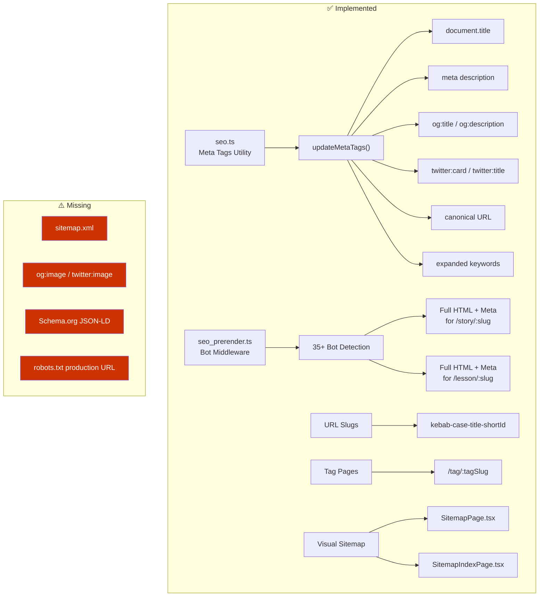
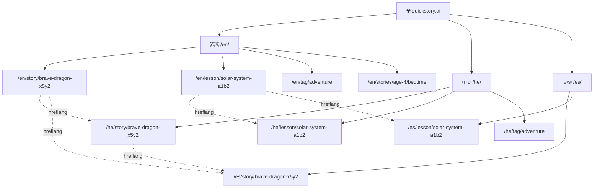
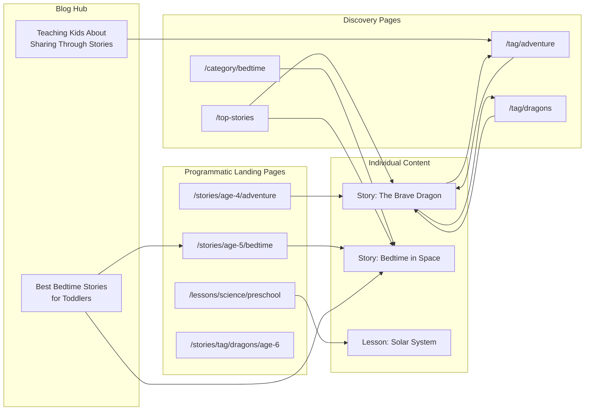
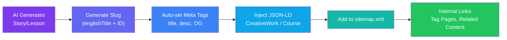

# QuickStory.AI — SEO Strategy Visual Guide

Visual companion to [seo_strategy.md](file:///home/guy_kashtan/quick/design/seo_strategy.md).

---

## Strategy Roadmap

---

## Implementation Priority Matrix

---

## Current SEO Architecture

---

## Multi-Language URL Architecture

> [!NOTE]
> Slugs are always derived from `englishTitle` for URL safety across all locales. The `<title>` and `<h1>` display the localized title.

---

## Long-Tail SEO Page Architecture

---

## Content Enrichment Flow

