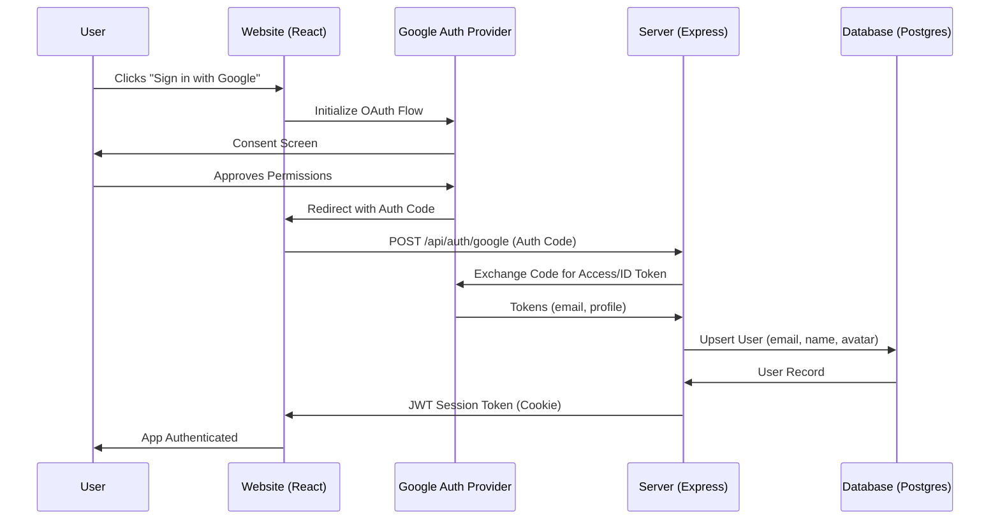

# Design: Social Login (Google OAuth2)

This document outlines the design for implementing social login using Google OAuth2 in the QuickStory.AI platform. This will replace the current mock authentication system with a secure, production-ready solution.

## Objective
Provide a seamless and secure authentication experience for users to save their generated stories, manage their library, and sync favorites across devices.

## Architecture Overview

The system uses a **Backend-Channel OAuth2** flow with JWT-based session management.

## Implementation Details

### 1. Frontend Changes (`website/`)

- **Library**: Use `@react-oauth/google` for simplified implementation.
- **AppContext**: 
    - Replace mock `login` with a call to the Google login hook.
    - Update `User` type to include persistent IDs from the database.
    - Add logic to store/refresh session tokens.
- **Header**: Maintain existing design but trigger the Google OAuth flow.

### 2. Backend Changes (`server/`)

- **New Dependencies**: `google-auth-library` or `passport-google-oauth20`, `jsonwebtoken`, `cookie-parser`.
- **Auth Routes**:
    - `POST /api/auth/google`: Verifies the ID token/Auth code and creates a session.
    - `POST /api/auth/logout`: Clears the session cookie.
    - `GET /api/auth/me`: Validates JWT and returns current user info.
- **Middleware**: `authenticateJWT` middleware to protect story/lesson persistence routes.

### 3. Database Schema

| Table | Column | Type | Description |
|-------|--------|------|-------------|
| **Users** | `id` | UUID | Primary Key |
| | `email` | String | Unique, from Google |
| | `name` | String | User's full name |
| | `avatar` | String | Google profile picture URL |
| | `googleId` | String | Unique ID from Google provider |
| | `createdAt`| DateTime | Timestamp |

### 4. Security Considerations

- **Secure Cookies**: Use `httpOnly`, `secure`, and `sameSite: 'Lax'` for JWT cookies.
- **Token Validation**: The server MUST verify the ID token's signature and audience (`aud`).
- **Environment Variables**:
    - `GOOGLE_CLIENT_ID`: OAuth credentials.
    - `GOOGLE_CLIENT_SECRET`: Server-side secret.
    - `JWT_SECRET`: Secret for signing session tokens.

## User Experience

1. **First-time Sign In**: A new user profile is automatically created in the database.
2. **Returning User**: Existing profile is retrieved, and recent stories are linked via `ownerId`.
3. **Persisted Sessions**: Users remain logged in even after page refreshes, as long as the JWT cookie is valid.

## Future Extensions
- Support for additional social providers (GitHub, Apple).
- Email/Password fallback (if requested).
- Tiered access based on subscription status.
